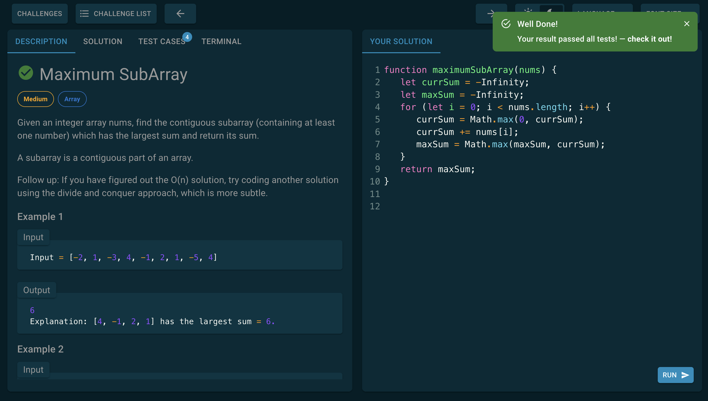

<div align="center">

<a href="javascript-challenges-pearl.vercel.app/" target="_blank">
  
</a>


[](https://nodejs.org/about/releases)

</div>

## 💖 Description:

> ### Coding out solutions to algorithm problems is the best way to increase your algorithms skills!!!

This Online Code platform provide over 160 coding questions classified in 8 Categories and 3 difficulty levels to maximize the understanding of algorithms and data structures.

The workspace lets you type out your answers and run them against a test suite, on your browser. And if you get stuck, the platform provide some hints to help you out. If your still stuck, the platform provide a solution with the best time & space complexity.

## 📦 Packages:

-   ⚡️ [Nextjs](https://nextjs.org/) - The React Framework for Production.
-   ⚒️ [React 18](https://es.reactjs.org/) - A JavaScript library for building user interfaces.
-   💙 [Typescript](https://www.typescriptlang.org/) - A superset of JavaScript.
-   💖 [MUI](https://mui.com/) - suite of UI tools.
-   🌐 [Vercel](https://vercel.com/) - a cloud platform to host deploy and scale automatically.
-   ⬛ [React-codemirror](https://sandpack.codesandbox.io/) - CodeMirror component for React.

## 🚀 Getting Started:

1. Clone the repository:

```bash
git clone https://github.com/Tigreton-dev/JavaScript-challenges.git
```

2. Install dependencies:

```bash
cd JavaScript-challenges
npm install
```

3. Run the following command to start the development server:

```bash
npm run dev
```

And ready 🥳, go to [localhost:3000](http://localhost:3000/).

## 🔑 License:

-   [MIT License](https://github.com/Tigreton-dev/JavaScript-challenges).
